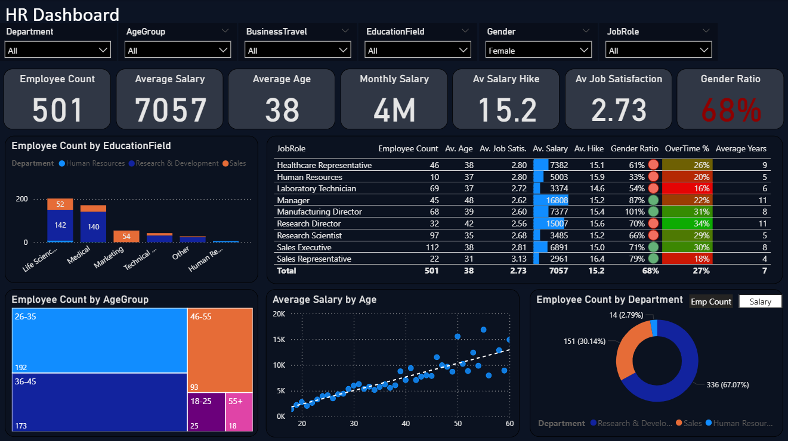
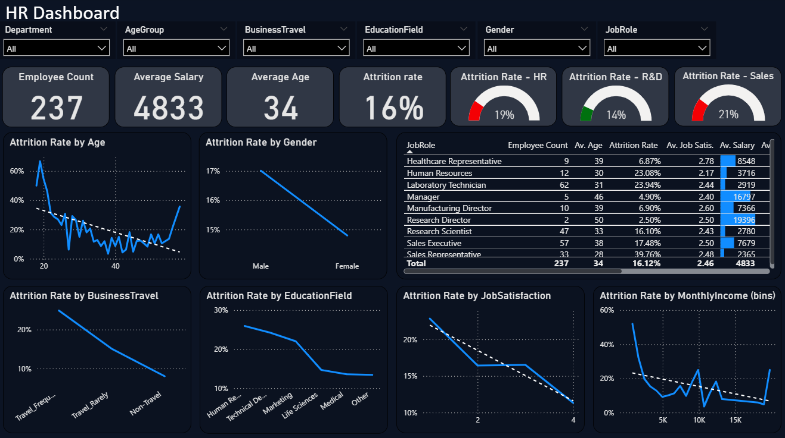

# 📊 HR Analytics Dashboard – Power BI Project

## 🌟 Objective
To develop an interactive **HR dashboard** in **Power BI** that provides insights into workforce composition, key HR metrics, and employee attrition, helping organizations make informed HR decisions.

---

## 📂 Data
- Source: CSV file with 1470 records
- Fields: Age, Gender, Role, Department, Income, Education, Attrition, Satisfaction, etc.
- Tool: Power BI Desktop

---

## 📊 Key Features

### ✍️ Workforce Overview
- Department, Education Field, Job Role, Business Travel, Gender, and Age Group breakdown

### 📈 HR KPIs
- Employee Count
- Average & Monthly Salary
- Average Age
- Job Satisfaction Score
- Salary Hike
- Gender Ratio

### 📉 Attrition Analysis
- Attrition rate by Job Satisfaction, Age, Salary, Marital Status, and Work-Life Balance
- High-risk departments: Sales, R&D, HR
- Role-based attrition insights

---

## 🔍 Key Insights

- **Overall Attrition**: 16% vs 12% industry average
- **Top Age Group**: 26–35 years (490 employees)
- **High Attrition Roles**: Sales Reps (40%), Lab Techs (24%), HR Specialists (23%)
- **Diversity Gap**: 68% male; only 33% females in HR
- **Low Job Satisfaction = High Attrition**: 23% vs 11%
- **Frequent Travelers**: 25% attrition vs 8% for rare travelers

---

## 📸 Dashboards

### 🎯 HR Overview Dashboard  

### 🧩 Attrition Analysis Dashboard  

---
## 🤝 Contributions

Contributions are welcome!  
If you have suggestions for improving the dashboard or adding new features, feel free to **submit a pull request**.
